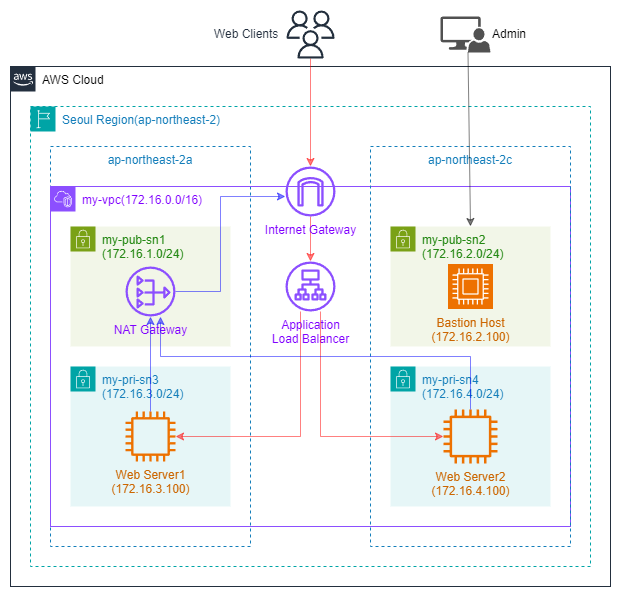

# 주제: 파이썬으로 AWS 기본 인프라 구축
> [!NOTE]
> **프로젝트 기간:** 2026.05.06 / **난이도:** ★★★★☆

## 프로젝트 구성도

## 프로젝트 목표:
1. AWS BOTO3(파이썬 모듈)로 파이썬 코드를 개발할 수 있다.
2. VPC, EC2, Main 등 계층적으로 코드 구조를 생성할 수 있다.
3. 생성된 자원을 확인하고 장애처리할 수 있다.

## 세부 내용:

---
Copyright (C) 2026. NETID
